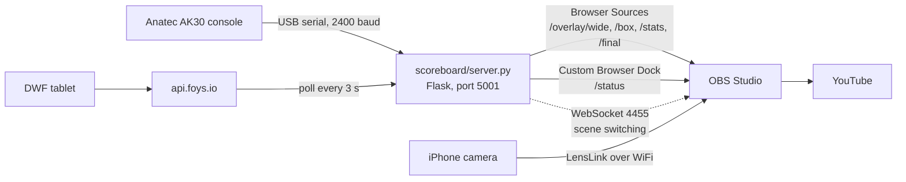

# anatec-ak30-obs-overlay

Live scoreboard overlay for OBS Studio, driven by an Anatec AK30 scoreboard
controller and the NBB's FOYS DWF match system.

The scoreboard operator works the AK30 as usual. The DWF tablet operator enters
the match as usual. The stream overlay updates itself: score, clock, period,
team fouls, timeouts, a popup per player foul, player stats at the break and a
final table when the match is closed. The server can also switch OBS scenes at
the half and at the end.

Built by Almere Pioneers (Almere, the Netherlands) for its own YouTube streams,
and published for other clubs with an Anatec scoreboard or the FOYS DWF. This
is an independent club project, not affiliated with Anatec, the NBB or FOYS.

---

## Status

What has actually run, and what has not.

| Part | Evidence |
|---|---|
| Anatec serial reader, frame parser, `--anatec auto` port discovery | Two live matches on 3 Oct 2026 (Almere Pioneers MSE2 and M18-1), both streamed to YouTube through OBS |
| FOYS polling: score, period, team and player fouls, timeouts, rosters, final stats; fetching every foul via `/offenses/all` | Same two matches. The `/offenses/all` fix came after the first match stopped showing foul popups at the tenth foul (see `docs/foys-api.md`) |
| Overlay pages as OBS Browser Sources, status dock | Same two matches |
| Second camera: iPhone 7 over WiFi through LensLink, started from the OBS dock | Same two matches |
| Automatic scene switching (halftime, back to court on play, final) | Built after those matches. 27 unit tests replaying real captured frames, plus dry runs at the desk. **Not yet run on a real match or against a real OBS.** |
| Scores above 99 on the Anatec frame | Not captured yet (`docs/protocol.md`) |
| Raspberry Pi at the officials' table relaying the serial feed | Idea only, nothing built |

---

## How it fits together

The Anatec feed is leading for score, clock, period and timeouts (it is what the
hall sees). FOYS is leading for fouls, names, logos and player stats. Either
source alone also works. `docs/foys-api.md` has the priority rules.

---

## Quick start

### At the desk: no hardware, no credentials, no OBS

    git clone https://github.com/apaiva58/anatec-ak30-obs-overlay.git
    cd anatec-ak30-obs-overlay
    python3 -m venv .venv
    source .venv/bin/activate
    pip install -r requirements.txt
    cp .env.example .env
    python3 scoreboard/server.py --anatec simulate --mock --no-obs

Then open http://localhost:5001/status (the operator card) and
http://localhost:5001/overlay/wide (the bottom bar). The simulator plays a
scripted period with mock rosters; `--no-obs` logs scene decisions without
touching OBS. Run the tests with `python3 tests/test_scene_logic.py`.

Python 3.9 or newer. The stock `python3` on macOS (3.9.6) is enough; it prints
a `urllib3`/LibreSSL warning at start, which is harmless.

### Match day

1. Fill in `.env`: FOYS credentials and the OBS WebSocket password (see
   Credentials below).
2. Connect the AK30 by USB, start OBS, then:

       python3 scoreboard/server.py --anatec auto

   `auto` probes the serial ports, picks the one emitting AK30 frames and
   rediscovers it if the cable is reseated. Fallback for a fixed port:
   `--anatec serial --port /dev/tty.usbserial-XXXX`.
3. Open http://localhost:5001 and pick the match.
4. OBS: Browser Sources on `http://localhost:5001/overlay/wide` (or `/box`,
   `/stats`, `/final`) at the canvas size, and `http://localhost:5001/status`
   as a Custom Browser Dock. Scene names go in `.env`.

Step by step, in Dutch, for the volunteer at the table: `docs/match-day.md`.
OBS, camera and streaming settings: `docs/obs-and-camera.md`.

Other modes: `--anatec off` (FOYS only), `--demo` (FOYS demo organisation),
`--mock --finalised` (mock data with the match already closed).
`python3 scoreboard/server.py --help` lists them all.

---

## Documentation

| File | Contents |
|---|---|
| `docs/protocol.md` | Anatec AK30 serial frame: byte map, timing, open questions |
| `docs/hardware.md` | Cables, the DIN 5-pin tap, tested configuration |
| `docs/foys-api.md` | FOYS DWF API as actually observed: endpoints, the `/offenses` cap, offense codes under FIBA Rules 2026, data priority between the two feeds |
| `docs/scenes.md` | Scene switching rules, the buzzer detector, what to change in `.env` |
| `docs/obs-and-camera.md` | OBS scenes and sources, WebSocket, docks, LensLink second camera, YouTube settings |
| `docs/match-day.md` | Checklist for the volunteer at the table (Dutch) |
| `probes/README.md` | Read-only FOYS probes and what each one established |

---

## Repository structure

    anatec-ak30-obs-overlay/
    ├── README.md
    ├── LICENSE                     MIT
    ├── requirements.txt
    ├── .env.example                copy to .env; .env is never committed
    ├── mock_data.json              fictional match and rosters for --mock
    ├── capture.py                  serial protocol capture and labelling
    ├── scoreboard/
    │   ├── server.py               Flask server, poll loop, routes, CLI
    │   ├── reader.py               Anatec serial reader and port discovery
    │   ├── parser.py               Anatec frame parser
    │   ├── simulator.py            scripted game for simulate mode
    │   ├── foys.py                 FOYS DWF client, roster join
    │   ├── state.py                shared in-memory match state
    │   ├── scene_logic.py          scene decisions (pure logic, tested)
    │   └── scene_control.py        OBS WebSocket client and controller
    ├── templates/
    │   ├── select.html             match selection (operator)
    │   ├── status.html             status page
    │   ├── status_card.html        status card (dock)
    │   ├── overlay_wide.html       bottom bar
    │   ├── overlay_box.html        corner box
    │   ├── overlay_stats.html      player stats at the break
    │   ├── overlay_final.html      final score
    │   ├── overlay.html            combined live + final
    │   ├── overlay_anatec.html     Anatec only
    │   └── overlay_foys.html       FOYS only
    ├── tests/
    │   └── test_scene_logic.py     27 tests; no pytest needed
    ├── probes/                     read-only FOYS API diagnostics
    └── docs/                       see above

---

## Hardware

Minimum: an Anatec AK30 controller, a USB-A to USB-B cable, and a laptop
running Python 3.9+ and OBS Studio. If the controller's USB port is not
active, the DIN 5-pin link to the display board can be tapped with an FTDI
FT232RL adapter; wiring in `docs/hardware.md`.

Developed and tested with the Anatec AK30-IPF (with personal-foul panels).
Other AK30 variants very likely send the same frame; if yours differs, run
`capture.py` and open an issue with the byte map.

---

## Requirements

- Python 3.9 or newer
- `pyserial`, `flask`, `requests`, `python-dotenv`, `obsws-python`
  (`pip install -r requirements.txt`)
- OBS Studio 28 or newer (WebSocket server built in). Used here: OBS 32.1.1
  on macOS 26.6.1.

---

## Credentials and `.env`

FOYS access is issued by the NBB at club level; ask your club's DWF
administrator for a dedicated streaming account rather than sharing the
scorer's login. The OBS WebSocket password comes from OBS: Tools > WebSocket
Server Settings.

`.env` is listed in `.gitignore` and must stay out of git. `.env.example` shows
every key:

    FOYS_USERNAME, FOYS_PASSWORD, FOYS_ORGANISATION_ID,
    FOYS_ORGANISATION_ID_DEMO, FOYS_DEMO_MODE
    OBS_WEBSOCKET_PASSWORD, OBS_WEBSOCKET_HOST, OBS_WEBSOCKET_PORT
    OBS_SCENE_COURT, OBS_SCENE_HALFTIME, OBS_SCENE_FINAL,
    OBS_STATS_AFTER_PERIODS, OBS_STATS_DELAY

If a password ever lands in a commit, treat it as public and change it in OBS
or FOYS; rewriting history does not take it back.

Note on privacy: FOYS rosters carry real names, often of minors. Screenshots
and captures for issues or docs should come from `--mock` data.

---

## Related projects

- LensLink, iPhone as a wireless camera for OBS on macOS:
  https://github.com/MyNamesEMurray/LensLink (GPL-2.0-or-later)
- OBS Studio: https://obsproject.com
- obsws-python, the OBS WebSocket 5 client used here:
  https://github.com/onyx-and-iris/obsws-python
- vMixScoreboard by Remco van den Enden, the starting point for the Anatec
  serial reader: https://github.com/remcoenden/vMixScoreboard

---

## Contributing

Issues and pull requests are welcome, in particular from clubs with another
Anatec model (byte map differences go in `docs/protocol.md`) and from anyone
who can confirm or correct the FOYS observations in `docs/foys-api.md`.

Conventions: English in code, comments and developer docs; Dutch in the
operator UI and the volunteer checklist. No credentials, personal ids or
venue IP addresses in the repo.

---

## Licence

MIT, see `LICENSE`. Unofficial: this project is not endorsed by or affiliated
with Anatec B.V., the Nederlandse Basketball Bond or FOYS.

Almere Pioneers, Almere, the Netherlands, https://almerepioneers.nl.
Development: dr. Antonio Paiva Aranda.
